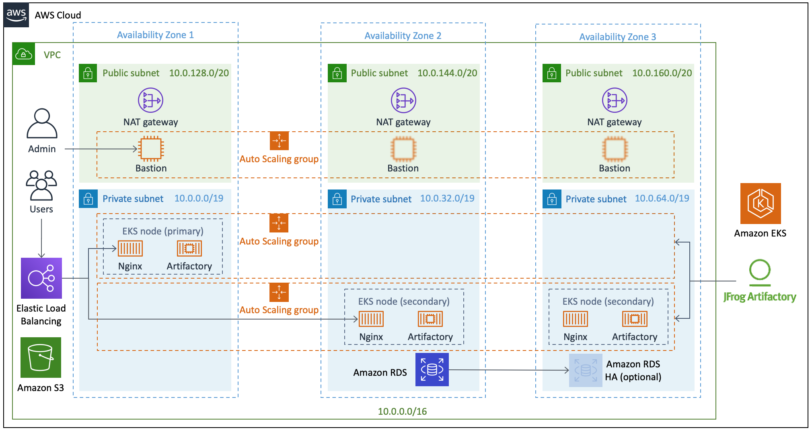

Deploying this Quick Start for a new virtual private cloud (VPC) with
default parameters builds the following _{partner-product-name}_ environment in the
AWS Cloud.

// Replace this example diagram with your own. Send us your source PowerPoint file. Be sure to follow our guidelines here : http://(we should include these points on our contributors giude)

:xrefstyle: short
[#architecture1]
.Quick Start architecture for Artifactory with Amazon EKS on AWS
[link=images/architecture_diagram.png]

The Quick Start sets up the following:

* A highly available architecture that spans three Availability Zones.*
* A VPC configured with public and private subnets, according to AWS best practices, to
provide you with your own virtual network on AWS.*
* A Network Load Balancer attached to the public subnets is listening on port 443 and
directs traffic via port 443 to the NGINX pod configured as a Load Balancer Kubernetes
object. The NGINX pod provides ingress, reverse proxy, and SSL termination for the
Artifactory primary and secondary nodes.

* A private and encrypted S3 bucket for repository storage.

In the public subnets:

* Managed NAT gateways to allow outbound internet access for resources in the
private subnets.*
* A Linux bastion host in an Auto Scaling group to allow inbound Secure Shell
(SSH) access to EC2 instances in public and private subnets.*

In the private subnets:

// Add bullet points for any additional components that are included in the deployment. Make sure that the additional components are also represented in the architecture diagram.
** An RDS instance connected via the private subnets of the VPC and only accessible from those subnets on port 3306.
** An EKS cluster with two partitions.
** A Helm deployment responsible for managing your Kubernetes deployment; the Helm deployment creates the following:
*** `jfrog-artifactory` namespace
*** NGINX SSL secret
*** Artifactory license secret
*** Artifactory database access secret
*** Primary, secondary, and NGINX pods

*The template that deploys the Quick Start into an existing VPC skips
the components marked by asterisks and prompts you for your existing VPC
configuration.

=== Amazon EKS services

There are two Auto Scaling groups for the Artifactory EKS hosts that make up the primary
and secondary https://kubernetes.io/docs/concepts/workloads/controllers/statefulset/#partitions[partitions^]. The pods are configured to be deployed in their respective
partitions. Upon an Artifactory service or overall pod failure, Kubernetes handles
rescheduling and redeploying the failed pod to a node. As a result, all configurations are
done on boot to each container and results in a loss of data that is not stored in the Amazon
RDS instance or the S3 bucket.

WARNING: Do not change the stack’s master key when you update the stack. This
will result in future nodes being unable to join the cluster and an unsupported
configuration. +
 +
To update a Secure Sockets Layer (SSL) certificate, you will need to update the
CloudFormation stack by changing the certificate and certificate key inputs, and redeploying the nodes (see <<_updating_artifactory, Updating Artifactory>>). If you change the certificate and
certificate key manually on the EC2 instances, instead of updating the
CloudFormation stack, the manual changes will be lost during the next upgrade or
reboot, resulting in an unwanted configuration.
